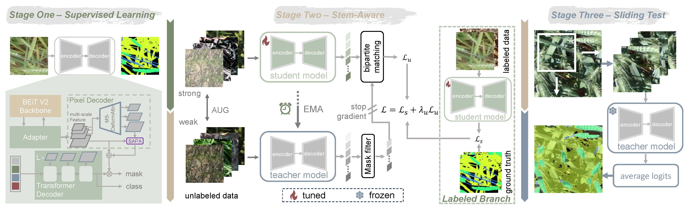

# First Place Solution to the MLCAS 2025 GWFSS Challenge: The Devil is in the Detail and Minority


This repository contains our team([HUST_TinySmart](https://www.codabench.org/profiles/organization/1459/))'s first place solution of the [Global Wheat Full Semantic Segmentation](https://www.codabench.org/competitions/5905/).

Our solution is based on [Guided Distillation](https://github.com/facebookresearch/GuidedDistillation). We also integrates the [SAPA](https://github.com/poppinace/sapa) feature upsampling operator and utilizes [ViT-Adapter](https://github.com/czczup/ViT-Adapter) as backbone networks within a semi-supervised training framework.

For details, see the paper: [First Place Solution to the MLCAS 2025 GWFSS Challenge: The Devil is in the Detail and Minority]()

Songliang Cao, Tianqi Hu, [Hao Lu](https://sites.google.com/site/poppinace/)

Correspondence to: [hlu@hust.edu.cn](mailto:hlu@hust.edu.cn), [songliangcao@126.com](mailto:songliangcao@126.com )

National Key Laboratory of Multispectral Information Intelligent Processing Technology
School of Artificial Intelligence and Automation
Huazhong University of Science and Technology, China.

## Overview

Our solution includes three stages: in stage one, we leverage the labeled training dataset to train a supervised baseline ViT-Adapter and enhance its detail delineation with a dynamic upsampler SAPA; in stage two, we apply a semi-supervised learning pipeline with guided distillation on both labeled data and selected unlabeled data; in stage three, we implement a form of test-time scaling by zooming in images and segmenting twice following the sliding-window-style inference.

## Installation
```
conda create -n gwfss python=3.8 -y
conda activate gwfss
pip install torch==1.9.0+cu111 torchvision==0.10.0+cu111 torchaudio==0.9.0 -f https://download.pytorch.org/whl/torch_stable.html
pip install -r requirements.txt
 
# build MSDformableAttention
cd ops
sh make.sh
 
# build detectron2
cd ../projects/detectron2
pip install -e .
 
# build SAPA operators
cd ../sapa/sapa
python setup.py develop
```

## Usage
To test our model on the GWFSS validation set, follow these instructions:
   - Download our trained model from [this link](https://drive.google.com/file/d/1pVSQe0YobV39s2U2eU9IDEl2t4Rj7pjB/view?usp=drive_link).
   - Modify the `inference.py` to change the model path and data path.
   - Run `sh test.sh`.

Here is the results of our solution on GWFSS competition:
| Backbone | #Param. | Public Leaderboard | Private Leaderboard |
| :--: | :--: | :--: | :--: | 
| [BEiTv2-L](https://drive.google.com/file/d/1pVSQe0YobV39s2U2eU9IDEl2t4Rj7pjB/view?usp=drive_link) | 348.7M | 0.77 | 0.75 | 


## Training
#### 1. Prepare the pretrained weight
   
- you can download the BEiTv2 pretrained [model](https://github.com/addf400/files/releases/download/BEiT-v2/beitv2_large_patch16_224_pt1k_ft1k.pth) from [here](https://github.com/microsoft/unilm/blob/master/beit2/get_started_for_image_classification.md)
   
- convert the weights to d2 format:
   ```bash
   python tools/convert-pretrained-model-to-d2.py weight.pth weight_stage1.pkl stage1 
       
   python tools/convert-pretrained-model-to-d2.py weight.pth weight_stage2.pkl stage2
    ```

#### 2. Parepare the dataset
- **labeled data**: modify both `data/data/datasets/bultin.py` and `projects/detectron2/detectron2/data/datasets/builtin.py` (refer to this [issue](https://github.com/facebookresearch/GuidedDistillation/issues/6))

- **unlabled data**: modify the `data/datasets/gwfss_images.py`; For GWFSS unlabeled data, you can select part of samples via `unlabeled_4500.txt`

#### 3. Run the training：
- **stage1: Supervised Training** 
   ```bash
   bash stage1_train.sh
   ```
- **stage2: Guided Distillation** 
   ```bash
   bash stage2_train.sh
   ```

## Citation
If you find this work or code useful for your research, please consider giving a star and citation:
```
@article{songliang2025gwfss
   title={First Place Solution to the MLCAS 2025 GWFSS Challenge: The Devil is in the Detail and Minority},
   author={Cao Songliang, Hu Tianqi and Lu Hao},
   booktitle = {Proceedings of the IEEE/CVF International Conference on Computer Vision (ICCV) Workshops},
   year={2025}
}
```

## License
Codes and model weights are released under MiT license. See [LICENSE](./LICENSE) for additional details.
